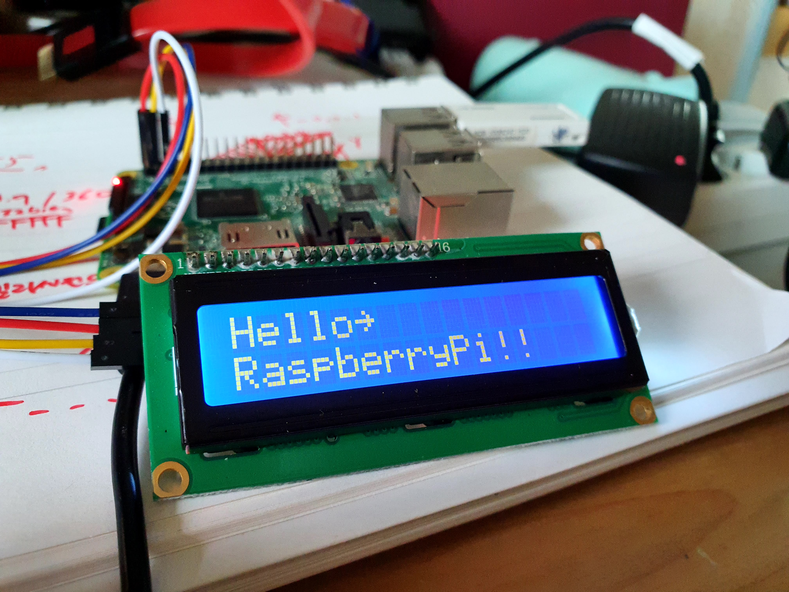
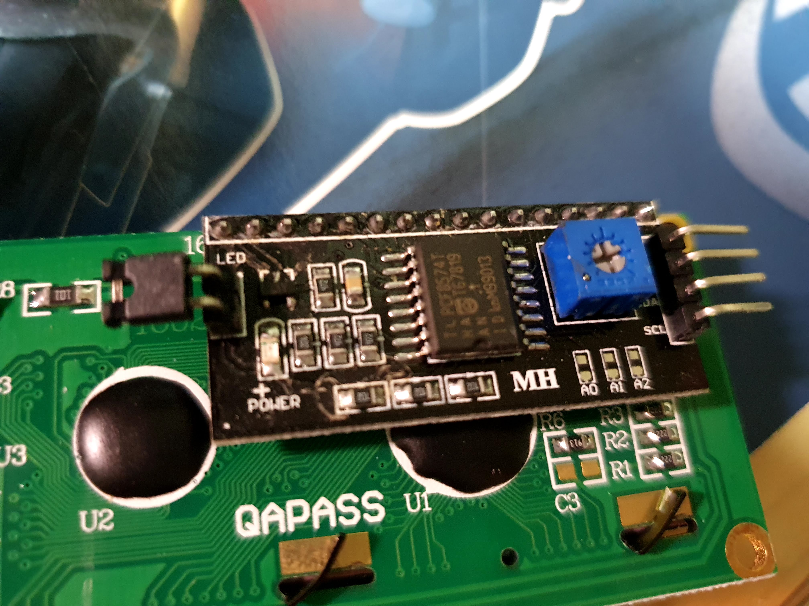

# pcf8574clcd

This is a driver for CLCD(Liquid Crystal) witch use PCF8574 I2C interface.

## Install

    go get github.com/suapapa/go_devices/pcf8574clcd

## Build Example

    $ cd _example
    $ GOARCH=arm GOOS=linux go build

## reference

* [fdebrabander/Arduino-LiquidCrystal-I2C-library](https://github.com/fdebrabander/Arduino-LiquidCrystal-I2C-library)
* [Arduino-LiquidCrystal-I2C-library tutorial](https://www.makerguides.com/character-i2c-lcd-arduino-tutorial/)